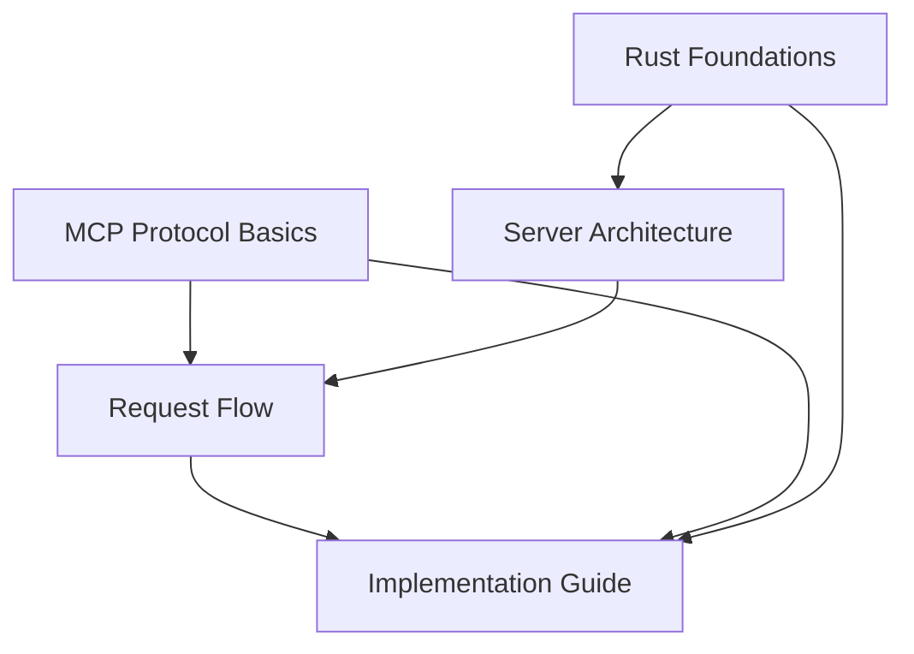

# Understanding the Mac Keyboard MCP Server

Welcome to the comprehensive documentation for the Mac Keyboard MCP (Model Context Protocol) server. This documentation set is designed for developers who are new to both Rust programming and MCP server implementation. Each document builds upon the previous ones, creating a learning path from basic concepts to advanced implementation details.

## 🎯 Purpose

This MCP server provides AppleScript key codes for macOS automation, allowing AI assistants like Claude to look up the correct numeric codes needed for simulating keyboard input. Understanding how it works will teach you:
- How to implement the Model Context Protocol
- Rust async programming patterns
- JSON-RPC communication
- Static data management
- Error handling best practices

## Table of Contents

1. [MCP Protocol Basics](./mcp-protocol-basics.md) - Understanding the Model Context Protocol and JSON-RPC
2. [Rust Foundations](./rust-foundations.md) - Essential Rust concepts used in this project
3. [Server Architecture](./server-architecture.md) - Static structure, modules, and design patterns
4. [Request Flow](./request-flow.md) - Dynamic behavior and message handling lifecycle
5. [Implementation Guide](./implementation-guide.md) - Building new features and extending the server

## 📚 How to Use This Documentation

### For Complete Beginners
Start with **MCP Protocol Basics** to understand what we're building, then move to **Rust Foundations** to grasp the language concepts. After that, explore the **Server Architecture** to see how everything fits together.

### For Rust Developers New to MCP
You might want to start with **MCP Protocol Basics** and then jump directly to **Request Flow** to understand the protocol dynamics.

### For MCP Developers New to Rust
Begin with **Rust Foundations** to understand Rust-specific patterns, then proceed to **Server Architecture** to see how Rust's features are leveraged.

## 🔗 Document Relationships

## 🚀 Quick Start

If you want to understand the server quickly:
1. Read the protocol overview in [MCP Protocol Basics](./mcp-protocol-basics.md)
2. Look at the main.rs walkthrough in [Request Flow](./request-flow.md)
3. Try implementing a simple feature using [Implementation Guide](./implementation-guide.md)

## 🛠️ Key Technologies

- **Rust**: Systems programming language with memory safety
- **Tokio**: Async runtime for handling I/O operations
- **Serde**: Serialization/deserialization framework
- **JSON-RPC 2.0**: Remote procedure call protocol
- **MCP**: Model Context Protocol for AI tool integration

## 📖 Learning Objectives

By the end of this documentation, you will understand:
- ✅ How MCP servers communicate with AI clients
- ✅ Rust's ownership model and async programming
- ✅ Modular architecture design in Rust
- ✅ Error handling and type safety patterns
- ✅ How to extend and maintain an MCP server

Let's begin your journey into understanding this MCP server implementation!