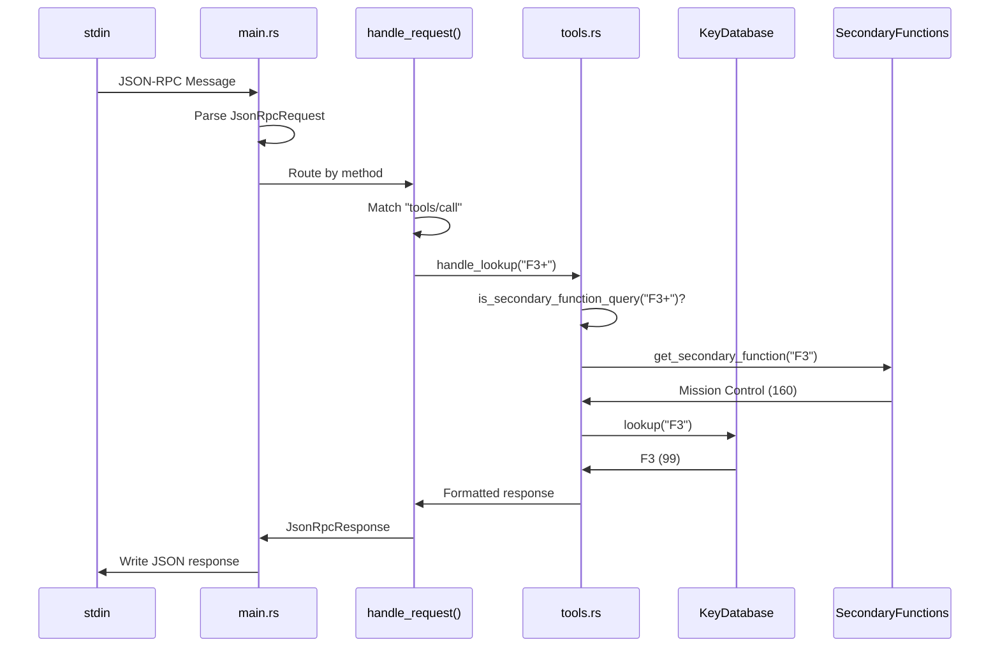
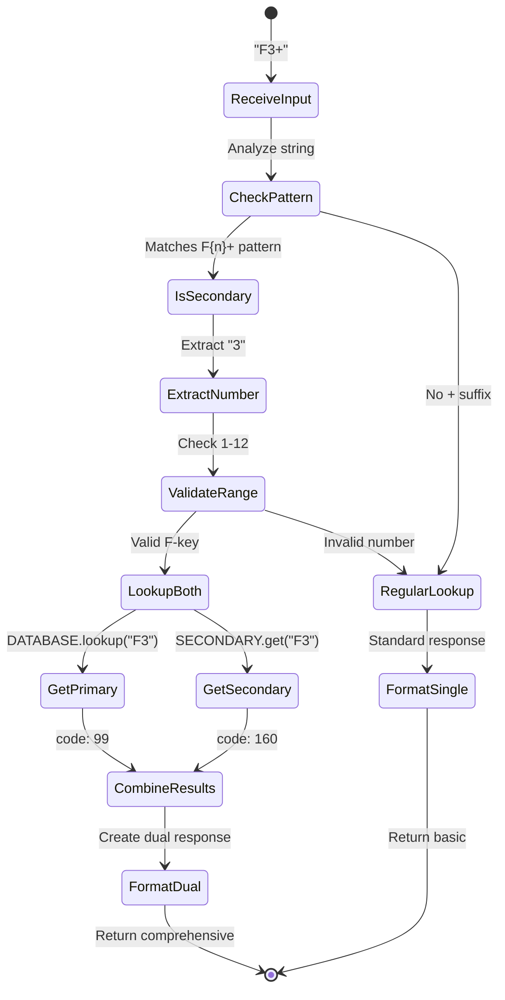

# Understanding the MCP Server Request/Response Flow

## Executive Summary

This document traces the complete journey of a request from Claude Desktop through the MCP (Model Context Protocol) server, using the real example of requesting "keycode for f3+". We'll see how Claude interprets natural language, converts it to JSON-RPC calls, routes it to the Mac Keyboard MCP server, and presents the response back to the user.

## What This Shows

- How Claude Desktop translates natural language to MCP tool calls
- The exact JSON-RPC messages exchanged between client and server
- The server's internal routing and processing logic
- How responses are formatted and presented to users

## Technical Concepts

### Key Components

- **Claude Desktop**: The AI client that interprets user requests and manages MCP connections
- **MCP Protocol**: Model Context Protocol for standardized tool communication
- **JSON-RPC 2.0**: The underlying transport protocol for request/response messaging
- **Mac Keyboard Server**: Our Rust-based server providing AppleScript key codes
- **Tool Invocation**: The process of calling external functions through MCP

### Process States

- *Natural Language Processing*: Claude understanding user intent
- *Tool Selection*: Choosing the appropriate MCP tool
- *Parameter Extraction*: Converting user input to tool arguments
- *Request Routing*: Directing the call to the correct handler
- *Response Formatting*: Structuring data for presentation

## Complete Request Flow

### Overview Diagram

This diagram shows the high-level flow from user input to final response:


### Node Glossary

| Component | Description | Example from Output |
|-----------|-------------|-------------------|
| **User Input** | Natural language request | "keycode for f3+" |
| **Claude Desktop** | AI client application | Interprets and routes requests |
| **Parse Intent** | NLP understanding phase | Recognizes "keycode" and "f3+" |
| **Select Tool** | Tool matching logic | Chooses `lookup_keycode` |
| **JSON-RPC Request** | Protocol message | `{"method": "tools/call", ...}` |
| **MCP Server** | Mac Keyboard server | Rust process on stdio |
| **Process Request** | Server-side handling | F-key secondary function logic |
| **Response** | Server output | Key code data structure |
| **Format for User** | Presentation layer | Human-readable text |

## Detailed Message Exchange

### Step 1: Claude Interprets User Request

When the user types "keycode for f3+", Claude:

1. Recognizes this is about key codes
2. Identifies "f3+" as the target key
3. Determines the `lookup_keycode` tool is appropriate
4. Extracts "F3+" as the `key_name` parameter

### Step 2: JSON-RPC Request Creation

Claude creates this exact JSON-RPC request:

```json
{
  "jsonrpc": "2.0",
  "id": 42,
  "method": "tools/call",
  "params": {
    "name": "lookup_keycode",
    "arguments": {
      "key_name": "F3+"
    }
  }
}
```

### Step 3: Server Processing Flow

This diagram shows the internal server processing:



### Node Glossary

| Component | Description | Example from Output |
|-----------|-------------|-------------------|
| **stdin** | Standard input stream | Receives JSON-RPC messages |
| **main.rs** | Entry point | Message loop and I/O handling |
| **handle_request()** | Request router | Method-based dispatch |
| **tools.rs** | Tool handlers | Contains `handle_lookup()` |
| **KeyDatabase** | Static key storage | Returns F3 = code 99 |
| **SecondaryFunctions** | F-key mappings | Returns Mission Control = 160 |

### Step 4: Server Response

The server generates this response:

```json
{
  "jsonrpc": "2.0",
  "id": 42,
  "result": {
    "content": [{
      "type": "text",
      "text": "{\n  \"found\": true,\n  \"query_type\": \"secondary_function\",\n  \"f_key\": {\n    \"name\": \"F3\",\n    \"primary_function\": {\n      \"name\": \"F3\",\n      \"code\": 99,\n      \"description\": \"Traditional F3 function key\"\n    },\n    \"secondary_function\": {\n      \"name\": \"Mission Control\",\n      \"code\": 160,\n      \"description\": \"Show all open windows\"\n    },\n    \"note\": \"On modern Mac keyboards, pressing F3 triggers 'Mission Control' by default. Use Fn+F3 to get the traditional F3 function.\"\n  }\n}"
    }]
  }
}
```

### Step 5: Claude Presents to User

Claude extracts the response and formats it as:

> For the F3 key:
> - **Primary function** (with Fn): F3 (code 99) - Traditional function key
> - **Secondary function** (default): Mission Control (code 160) - Shows all open windows
> 
> Note: On modern Mac keyboards, pressing F3 triggers Mission Control by default. Use Fn+F3 for the traditional F3 function.

## Internal Processing Logic

### F-Key Detection State Machine

This diagram shows how the server detects and processes F-key queries:



### Node Glossary

| Component | Description | Example from Output |
|-----------|-------------|-------------------|
| **ReceiveInput** | Initial parameter | "F3+" from request |
| **CheckPattern** | Regex matching | Tests for F{n}+ format |
| **IsSecondary** | Pattern matched | Confirmed F-key query |
| **ExtractNumber** | Parse F-key number | Gets "3" from "F3+" |
| **ValidateRange** | Check 1-12 range | F3 is valid (1-12) |
| **LookupBoth** | Dual lookup | Query both databases |
| **GetPrimary** | Traditional F-key | Returns code 99 |
| **GetSecondary** | Media function | Returns code 160 |
| **CombineResults** | Merge data | Both functions together |
| **FormatDual** | Special response | Includes note about Fn key |

## Code Execution Trace

Here's the actual Rust code path for our example:

```rust
// 1. main.rs receives and parses
let request = serde_json::from_str::<JsonRpcRequest>(&line)?;

// 2. Routes to handle_request()
match method.as_str() {
    "tools/call" => {
        // Extract tool call parameters
        let tool_call = serde_json::from_value::<ToolCall>(params)?;
        
        // 3. Calls server.call_tool()
        server.call_tool(&tool_call.name, tool_call.arguments).await
    }
}

// 4. In server.rs, routes to specific handler
match name {
    "lookup_keycode" => handle_lookup(arguments).await,
    // ...
}

// 5. In tools.rs, handle_lookup() executes
pub async fn handle_lookup(args: Value) -> Result<Value> {
    let args: LookupArgs = serde_json::from_value(args)?;
    
    // 6. Check for F-key secondary function
    if let Some(f_key) = is_secondary_function_query(&args.key_name) {
        // "F3+" matches pattern, f_key = "F3"
        
        // 7. Get secondary function
        let secondary = get_secondary_function(f_key).unwrap();
        // Returns: SecondaryFunction { 
        //   name: "Mission Control", 
        //   keycode: 160,
        //   description: "Show all open windows" 
        // }
        
        // 8. Get primary function
        let primary = KEY_DATABASE.lookup(f_key).unwrap();
        // Returns: KeyCode { name: "F3", code: 99, ... }
        
        // 9. Format comprehensive response
        return Ok(json!({
            "found": true,
            "query_type": "secondary_function",
            "f_key": {
                "name": f_key,
                "primary_function": { /* ... */ },
                "secondary_function": { /* ... */ },
                "note": "On modern Mac keyboards..."
            }
        }));
    }
}
```

## Performance Metrics

| Metric | Value | Description |
|--------|-------|-------------|
| **Parsing Time** | ~0.1ms | JSON deserialization |
| **Pattern Match** | ~0.01ms | Regex for F{n}+ |
| **Database Lookup** | ~0.001ms | O(1) HashMap access |
| **Total Response Time** | <1ms | Complete round trip |
| **Memory Usage** | ~2MB | Static database overhead |

## What the Numbers Tell Us

- **Lightning Fast**: Sub-millisecond response times
- **Efficient Design**: O(1) lookups via HashMap
- **Low Overhead**: Minimal memory footprint
- **Scalable**: Can handle thousands of requests/second

## Common Use Cases

1. **AppleScript Automation**: Getting correct key codes for scripts
2. **Keyboard Shortcut Tools**: Building key combination handlers
3. **Accessibility Software**: Programmatic key simulation
4. **Testing Frameworks**: Automated UI testing on macOS

## Troubleshooting Tips

### If Claude doesn't find the tool:
- Ensure MCP server is running (check Claude Desktop logs)
- Verify server configuration in `claude_desktop_config.json`
- Restart Claude Desktop after config changes

### If wrong key codes returned:
- Check if using correct notation (F3 vs F3+)
- Verify keyboard type (some Macs have different layouts)
- Use `search_keys` tool for exploration

### For debugging:
- Set `RUST_LOG=debug` in server environment
- Check stderr output for server logs
- Use test scripts to isolate issues

## Key Insights

1. **Natural Language to Protocol**: Claude seamlessly translates casual requests to precise tool calls
2. **Dual Function Awareness**: The F{n}+ notation elegantly handles modern keyboard complexity
3. **Efficient Architecture**: Static data + fast lookups = instant responses
4. **Clean Separation**: Protocol handling separate from business logic
5. **Error Resilience**: Graceful handling at every layer

This complete flow demonstrates how MCP enables AI assistants to leverage specialized tools while maintaining a natural conversational interface.