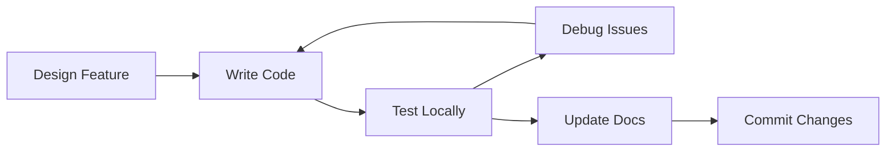

# Implementation Guide

This guide walks you through **extending** and **building features** for the Mac Keyboard MCP server. We'll implement a new tool step-by-step to demonstrate the process.

## Development Setup

### Prerequisites

```bash
# Install Rust
curl --proto '=https' --tlsv1.2 -sSf https://sh.rustup.rs | sh

# Clone the repository
git clone https://github.com/time4Wiley/mac-keyboard-mcp.git
cd mac-keyboard-mcp

# Build the project
cargo build --release
```

### Development Workflow



### Node Glossary
| Node | Description |
|------|-------------|
| **Design** | Plan the feature and API |
| **Implement** | Write Rust code |
| **Test** | Run manual and automated tests |
| **Debug** | Fix issues using logs |
| **Document** | Update README and docs |

## Example: Adding a New Tool

Let's implement a `get_modifier_combinations` tool that returns all modifier key combinations for a given key.

### Step 1: Design the Tool

First, define the tool's purpose and interface:

**Purpose**: Generate all possible modifier combinations
**Input**: A base key name
**Output**: Array of combinations with Command, Shift, Option, Control

### Step 2: Add Tool Definition

Edit `src/mcp/tools.rs`:

```rust
/// Tool definition for get_modifier_combinations
pub fn get_modifier_combinations_tool() -> Value {
    json!({
        "name": "get_modifier_combinations",
        "description": "Generate all modifier combinations for a key",
        "inputSchema": {
            "type": "object",
            "properties": {
                "key_name": {
                    "type": "string",
                    "description": "Base key (e.g., 'A', 'Space')"
                }
            },
            "required": ["key_name"]
        }
    })
}
```

### Step 3: Add to Tool List

In `src/mcp/server.rs`, update `list_tools()`:

```rust
pub fn list_tools(&self) -> Vec<Value> {
    vec![
        lookup_keycode_tool(),
        search_keys_tool(),
        get_key_combinations_tool(),
        list_categories_tool(),
        get_modifier_combinations_tool(),  // Add new tool
    ]
}
```

### Step 4: Implement Handler

Add to `src/mcp/tools.rs`:

```rust
#[derive(Deserialize)]
struct ModifierArgs {
    key_name: String,
}

pub async fn handle_modifier_combinations(args: Value) -> Result<Value> {
    let args: ModifierArgs = serde_json::from_value(args)?;
    
    // Look up the base key
    let base_key = KEY_DATABASE.lookup(&args.key_name)
        .ok_or_else(|| anyhow!("Key not found: {}", args.key_name))?;
    
    // Define modifiers
    let modifiers = vec![
        ("Command", 55),
        ("Shift", 56),
        ("Option", 58),
        ("Control", 59),
    ];
    
    // Generate combinations
    let mut combinations = vec![];
    
    // Single key (no modifiers)
    combinations.push(json!({
        "description": args.key_name.clone(),
        "keycodes": vec![base_key.code],
        "modifiers": Vec::<String>::new(),
    }));
    
    // All possible modifier combinations
    for i in 1..=modifiers.len() {
        for combo in modifiers.iter().combinations(i) {
            let modifier_names: Vec<String> = combo.iter()
                .map(|(name, _)| name.to_string())
                .collect();
            
            let modifier_codes: Vec<u16> = combo.iter()
                .map(|(_, code)| *code)
                .collect();
            
            let description = format!("{} + {}", 
                modifier_names.join(" + "), 
                args.key_name
            );
            
            let mut all_codes = modifier_codes.clone();
            all_codes.push(base_key.code);
            
            combinations.push(json!({
                "description": description,
                "keycodes": all_codes,
                "modifiers": modifier_names,
            }));
        }
    }
    
    Ok(json!({
        "key": {
            "name": base_key.name,
            "code": base_key.code,
        },
        "combinations": combinations,
        "total": combinations.len(),
    }))
}
```

### Step 5: Wire Up the Handler

In `src/mcp/server.rs`, update `call_tool()`:

```rust
pub async fn call_tool(&self, name: &str, arguments: Value) -> Result<Value> {
    match name {
        "lookup_keycode" => handle_lookup(arguments).await,
        "search_keys" => handle_search(arguments).await,
        "get_key_combinations" => handle_combinations(arguments).await,
        "list_categories" => handle_categories(arguments).await,
        "get_modifier_combinations" => handle_modifier_combinations(arguments).await,
        _ => Err(anyhow!("Unknown tool: {}", name)),
    }
}
```

### Step 6: Test the Implementation

Create a test script:

```python
#!/usr/bin/env python3
import json
import subprocess

def test_modifier_tool():
    proc = subprocess.Popen(
        ["./target/release/mac-keyboard-mcp"],
        stdin=subprocess.PIPE,
        stdout=subprocess.PIPE,
        text=True
    )
    
    # Initialize
    proc.stdin.write(json.dumps({
        "jsonrpc": "2.0",
        "id": 1,
        "method": "initialize"
    }) + "\n")
    proc.stdin.flush()
    
    # Call new tool
    proc.stdin.write(json.dumps({
        "jsonrpc": "2.0",
        "id": 2,
        "method": "tools/call",
        "params": {
            "name": "get_modifier_combinations",
            "arguments": {"key_name": "A"}
        }
    }) + "\n")
    proc.stdin.flush()
    
    # Read responses
    init_response = proc.stdout.readline()
    tool_response = proc.stdout.readline()
    
    print(json.dumps(json.loads(tool_response), indent=2))
    proc.terminate()

if __name__ == "__main__":
    test_modifier_tool()
```

## Common Implementation Patterns

### Pattern 1: Input Validation

```rust
// Define typed arguments
#[derive(Deserialize)]
struct ToolArgs {
    #[serde(default)]
    optional_field: bool,
    required_field: String,
}

// Validate in handler
let args: ToolArgs = serde_json::from_value(args)
    .map_err(|e| anyhow!("Invalid arguments: {}", e))?;
```

### Pattern 2: Error Handling

```rust
// Use Result type
pub async fn handle_tool(args: Value) -> Result<Value> {
    // Use ? operator for propagation
    let data = do_something()?;
    
    // Use ok_or_else for Option -> Result
    let value = optional_value
        .ok_or_else(|| anyhow!("Value not found"))?;
    
    Ok(json!({"result": data}))
}
```

### Pattern 3: Response Formatting

Always wrap tool responses in the MCP content structure:

```rust
Ok(json!({
    "content": [{
        "type": "text",
        "text": serde_json::to_string_pretty(&result)?
    }]
}))
```

## Adding New Resources

To add a new resource endpoint:

1. **Define in `resources.rs`**:
```rust
pub fn my_resource() -> Value {
    json!({
        "uri": "keycode://my-resource",
        "name": "My Resource",
        "description": "Description here",
        "mimeType": "application/json"
    })
}
```

2. **Add to resource list**:
```rust
pub fn list_resources(&self) -> Vec<Value> {
    vec![
        all_keycodes_resource(),
        aliases_resource(),
        my_resource(),  // Add here
    ]
}
```

3. **Handle in `read_resource_content()`**:
```rust
match uri {
    "keycode://my-resource" => {
        Ok(json!({
            "data": "Resource content"
        }))
    }
    // ... other cases
}
```

## Testing Strategies

### Unit Tests

```rust
#[cfg(test)]
mod tests {
    use super::*;
    
    #[test]
    fn test_key_lookup() {
        let key = KEY_DATABASE.lookup("Space");
        assert!(key.is_some());
        assert_eq!(key.unwrap().code, 49);
    }
}
```

### Integration Tests

Create files in `tests/` directory:

```rust
// tests/integration_test.rs
#[test]
fn test_full_flow() {
    // Test complete request/response cycle
}
```

### Manual Testing with Claude Desktop

1. Build release version: `cargo build --release`
2. Update Claude Desktop config
3. Restart Claude Desktop
4. Test in conversation

## Debugging Techniques

### Enable Detailed Logging

```rust
// Add debug statements
debug!("Processing request: {:?}", request);
info!("Tool called: {}", tool_name);
error!("Failed to parse: {}", e);
```

### View Logs

```bash
# Set log level
RUST_LOG=debug ./target/release/mac-keyboard-mcp

# Logs appear on stderr
```

### Common Issues and Solutions

| Issue | Solution |
|-------|----------|
| **JSON parse errors** | Check request format, use raw logging |
| **Tool not found** | Verify tool registered in server |
| **Null responses** | Ensure returning Some() not None |
| **Type mismatches** | Check Serde attributes |

## Best Practices

1. **Keep Tools Focused**: One tool, one purpose
2. **Validate Inputs**: Use typed structs with Serde
3. **Handle Errors Gracefully**: Return helpful error messages
4. **Document Everything**: Update README for new features
5. **Test Thoroughly**: Unit tests + integration tests
6. **Follow Conventions**: Match existing code style

## Performance Tips

- **Avoid Allocations**: Use references when possible
- **Lazy Loading**: Initialize heavy data once
- **Efficient Lookups**: Use HashMap for O(1) access
- **Async Wisely**: Only for actual I/O operations

## Related Documentation

- Review basics in [MCP Protocol Basics](./mcp-protocol-basics.md)
- Understand Rust in [Rust Foundations](./rust-foundations.md)
- See architecture in [Server Architecture](./server-architecture.md)
- Trace flows in [Request Flow](./request-flow.md)

## Conclusion

You now have the knowledge to:
- Add new tools and resources
- Debug issues effectively
- Test your implementations
- Follow best practices

Happy coding! Remember to contribute your improvements back to the open-source project.