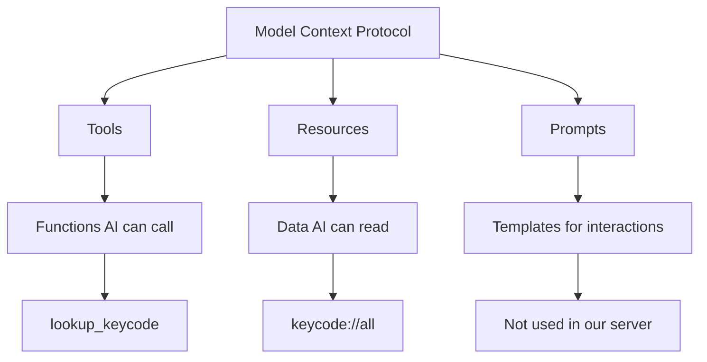
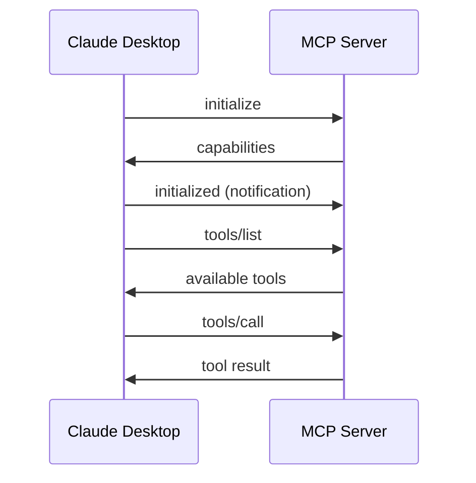

# MCP Protocol Basics

The **Model Context Protocol (MCP)** is a standardized way for AI assistants to communicate with external tools and data sources. This document explains the core concepts and how they apply to our Mac Keyboard server.

## What is MCP?

MCP enables AI assistants like Claude to:
- Call functions (tools) in external servers
- Access structured data (resources)
- Use predefined prompts
- Maintain consistent communication patterns

### The Three Pillars of MCP



### Node Glossary
| Node | Description |
|------|-------------|
| **MCP** | The overarching protocol specification |
| **Tools** | Callable functions with defined inputs/outputs |
| **Resources** | Readable data endpoints with URIs |
| **Prompts** | Reusable interaction templates |

## JSON-RPC 2.0 Foundation

MCP is built on top of **JSON-RPC 2.0**, a lightweight remote procedure call protocol. Every message follows this structure:

```json
{
  "jsonrpc": "2.0",
  "id": 1,
  "method": "tools/call",
  "params": {
    "name": "lookup_keycode",
    "arguments": {"key_name": "F3"}
  }
}
```

### Key JSON-RPC Concepts

1. **Request**: Has an `id`, `method`, and optional `params`
2. **Response**: Has the same `id` and either `result` or `error`
3. **Notification**: A request without an `id` (no response expected)

## MCP Communication Flow



### Node Glossary
| Node | Description |
|------|-------------|
| **Claude Desktop** | The AI client requesting services |
| **MCP Server** | Our Rust server providing key codes |
| **initialize** | Handshake to establish connection |
| **capabilities** | Server's supported features |
| **tools/list** | Request for available tools |

## Our Server's MCP Implementation

### Tools Provided

Our server exposes four tools:

1. **lookup_keycode**: Find AppleScript key code for a specific key
2. **search_keys**: Search for keys by pattern or category
3. **get_key_combinations**: Parse keyboard shortcuts
4. **list_categories**: List all key categories

### Resources Provided

Two main resource types:

1. **keycode://all**: Complete key code database
2. **keycode://category/{name}**: Keys by specific category

### Transport Mechanism

We use **stdio** (standard input/output) for communication:
- Messages arrive via `stdin`
- Responses sent via `stdout`
- Logs written to `stderr`

## Understanding Protocol Messages

Let's examine a real tool call:

```json
// Request
{
  "jsonrpc": "2.0",
  "id": 3,
  "method": "tools/call",
  "params": {
    "name": "lookup_keycode",
    "arguments": {
      "key_name": "Space"
    }
  }
}

// Response
{
  "jsonrpc": "2.0",
  "id": 3,
  "result": {
    "content": [{
      "type": "text",
      "text": "{\"found\": true, \"key\": {\"name\": \"Space\", \"code\": 49}}"
    }]
  }
}
```

### Important Protocol Rules

1. **Always echo the request ID** in responses
2. **Notifications don't get responses** (no ID = notification)
3. **Errors use specific codes** (-32700 for parse errors, etc.)
4. **Content wrapping** is required for tool results

## Why MCP Matters

MCP provides:
- **Standardization**: All tools work the same way
- **Discovery**: Clients can explore available capabilities
- **Type Safety**: Schemas define expected inputs
- **Extensibility**: Easy to add new tools/resources

## Related Documentation

- See [Rust Foundations](./rust-foundations.md) for language-specific implementation details
- Continue with [Request Flow](./request-flow.md) to understand message handling
- Learn about the server structure in [Server Architecture](./server-architecture.md)

## Next Steps

Now that you understand the protocol, let's explore how Rust helps us implement it efficiently in [Rust Foundations](./rust-foundations.md).