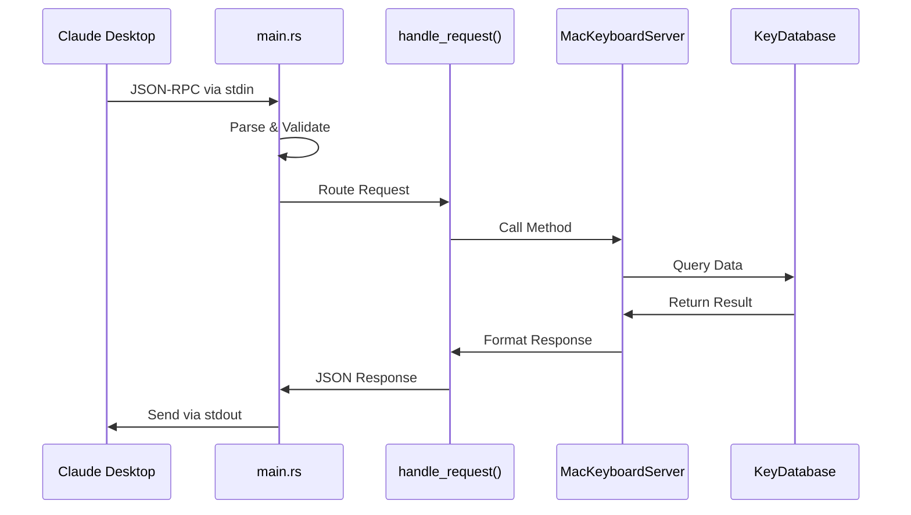
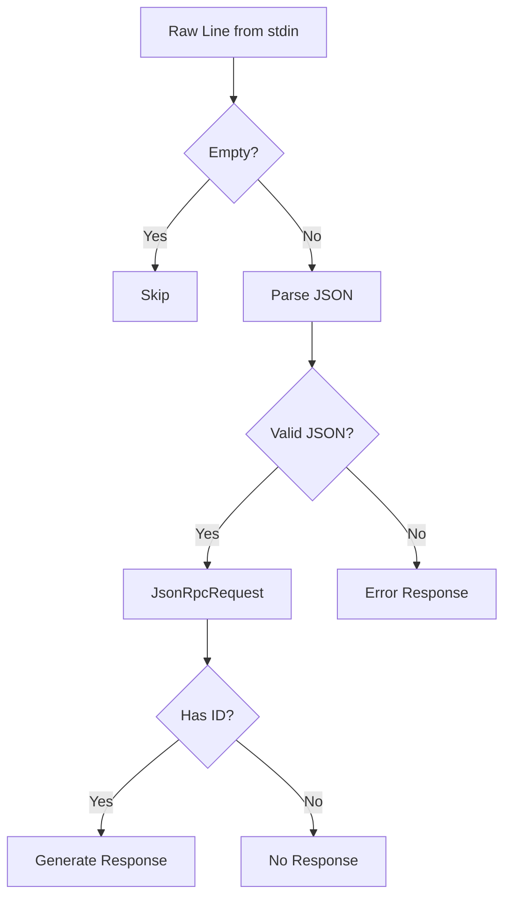
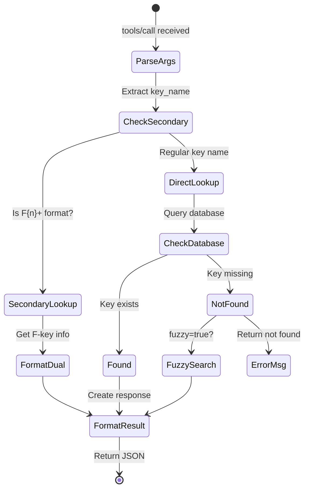

# Request Flow and Dynamic Behavior

This document traces the **dynamic behavior** of the MCP server, following requests from arrival to response. Understanding this flow is crucial for debugging and extending the server.

## Request Lifecycle Overview



### Node Glossary
| Node | Description |
|------|-------------|
| **Claude Desktop** | The MCP client |
| **main.rs** | Entry point and I/O handler |
| **handle_request()** | Request router function |
| **MacKeyboardServer** | Business logic container |
| **KeyDatabase** | Static data repository |

## Phase 1: Server Initialization

When the server starts:

```rust
#[tokio::main]
async fn main() -> Result<()> {
    // 1. Setup logging to stderr
    tracing_subscriber::fmt()
        .with_writer(io::stderr)
        .init();
    
    // 2. Create server instance
    let server = MacKeyboardServer::new()?;
    
    // 3. Setup I/O streams
    let stdin = io::stdin();
    let reader = BufReader::new(stdin);
    let mut stdout = io::stdout();
    
    // 4. Enter message loop
    for line in reader.lines() {
        // Process messages...
    }
}
```

## Phase 2: Message Reception

### Input Processing Flow



### Node Glossary
| Node | Description |
|------|-------------|
| **Raw Line** | Text from stdin |
| **Parse JSON** | Serde deserialization |
| **JsonRpcRequest** | Typed request object |
| **Has ID** | Request vs Notification check |

## Phase 3: Request Routing

The `handle_request` function routes based on method:

```rust
match method.as_str() {
    "initialize" => {
        // Return server capabilities
    },
    "tools/list" => {
        // List available tools
    },
    "tools/call" => {
        // Execute specific tool
    },
    "resources/list" => {
        // List available resources
    },
    "resources/read" => {
        // Read specific resource
    },
    _ => {
        // Method not found error
    }
}
```

## Phase 4: Tool Execution

Let's trace a `lookup_keycode` call:



### Node Glossary
| State | Description |
|------|-------------|
| **ParseArgs** | Extract tool arguments |
| **CheckSecondary** | Detect F{n}+ pattern |
| **DirectLookup** | Standard key search |
| **FuzzySearch** | Typo-tolerant search |
| **FormatResult** | JSON response creation |

### Example Execution Trace

Request:
```json
{
  "method": "tools/call",
  "params": {
    "name": "lookup_keycode",
    "arguments": {"key_name": "Space"}
  }
}
```

Flow:
1. **Extract params** → `ToolCall { name: "lookup_keycode", arguments: ... }`
2. **Route to handler** → `handle_lookup(args)`
3. **Database lookup** → `KEY_DATABASE.lookup("Space")`
4. **Format response** → Wrap in MCP content structure

## Phase 5: Response Generation

All responses follow this pattern:

```rust
JsonRpcResponse {
    jsonrpc: "2.0".to_string(),
    id: request.id,  // Echo request ID
    result: Some(json!({
        // Method-specific result
    })),
    error: None,
}
```

### Error Handling Flow

When errors occur:

```rust
JsonRpcResponse {
    jsonrpc: "2.0".to_string(),
    id: request.id,
    result: None,
    error: Some(JsonRpcError {
        code: -32602,  // Standard error code
        message: "Invalid params".to_string(),
        data: Some(json!({"details": "..."})),
    }),
}
```

## Special Cases

### 1. Initialization Handshake

```
Client → Server: initialize
Server → Client: capabilities
Client → Server: initialized (notification)
Server: (no response for notification)
```

### 2. F-Key Secondary Functions

When querying "F3+":
1. Detect pattern with `is_secondary_function_query()`
2. Get both primary (F3) and secondary (Mission Control) info
3. Return comprehensive dual-function response

### 3. Fuzzy Search

When exact match fails and `fuzzy: true`:
1. Use `FuzzySearcher` with scoring algorithm
2. Return top 5 suggestions with confidence scores
3. Include in response as suggestions array

## Performance Characteristics

- **Lookup Operations**: O(1) HashMap access
- **Search Operations**: O(n) with early termination
- **JSON Parsing**: Linear in message size
- **Memory Usage**: Constant after initialization

## State Management

The server maintains minimal state:
- **Initialization flag**: Track handshake completion
- **Static database**: Immutable after loading
- **No session state**: Each request independent

## Concurrency Model

```rust
#[tokio::main]  // Single-threaded async runtime
async fn main() -> Result<()>
```

Benefits:
- No race conditions
- Predictable execution order
- Simple debugging
- Low overhead

## Error Recovery

The server handles errors gracefully:
1. **Parse errors** → Error response with details
2. **Unknown methods** → -32601 error code
3. **Invalid params** → -32602 error code
4. **Internal errors** → -32603 error code

## Related Documentation

- Understand the protocol in [MCP Protocol Basics](./mcp-protocol-basics.md)
- Review architecture in [Server Architecture](./server-architecture.md)
- Learn to extend in [Implementation Guide](./implementation-guide.md)

## Next Steps

Now that you understand how requests flow through the system, learn how to implement new features in the [Implementation Guide](./implementation-guide.md).