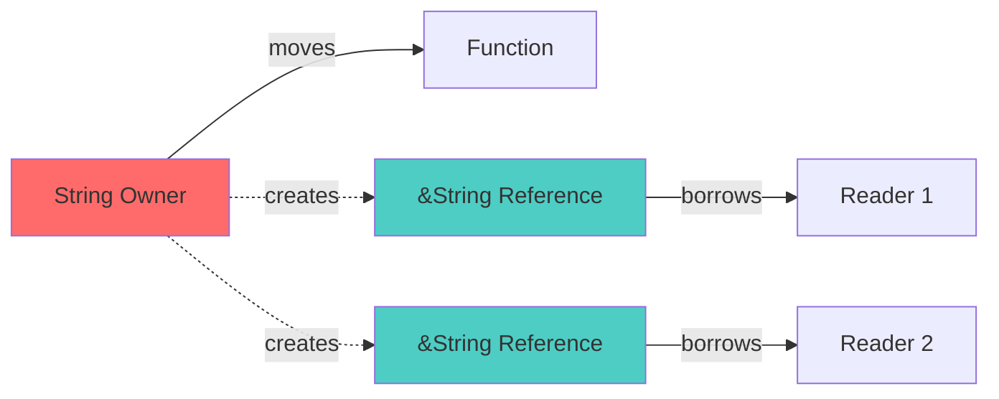
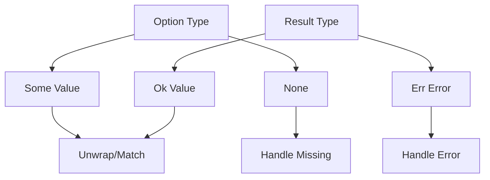

# Rust Foundations for MCP Development

This document covers the essential **Rust** concepts you need to understand our MCP server implementation. We'll focus on the patterns and features actually used in the codebase.

## Why Rust for MCP Servers?

Rust provides:
- **Memory safety** without garbage collection
- **Fearless concurrency** for async I/O operations
- **Zero-cost abstractions** for high performance
- **Strong type system** preventing runtime errors

## Core Rust Concepts Used

### 1. Ownership and Borrowing



### Node Glossary
| Node | Description |
|------|-------------|
| **String Owner** | The variable that owns the data |
| **&String Reference** | Immutable borrow of the data |
| **Function** | Takes ownership (data moved) |
| **Reader** | Borrows data temporarily |

In our server:
```rust
// Ownership transfer
let response = handle_request(&server, request).await;  // request moved

// Borrowing
pub fn lookup(&self, key: &str) -> Option<&KeyCode> {  // borrows key
    self.by_name.get(key)
}
```

### 2. Pattern Matching

Rust's `match` is used extensively for handling different message types:

```rust
match method.as_str() {
    "initialize" => { /* handle initialization */ },
    "tools/list" => { /* list tools */ },
    "tools/call" => { /* execute tool */ },
    _ => { /* unknown method */ }
}
```

### 3. Option and Result Types



### Node Glossary
| Node | Description |
|------|-------------|
| **Option Type** | May or may not contain a value |
| **Result Type** | Success or error outcome |
| **Some/Ok** | Contains successful value |
| **None/Err** | Missing value or error |

Examples from our code:
```rust
// Option for nullable values
pub fn lookup(&self, key: &str) -> Option<&KeyCode>

// Result for operations that can fail
async fn handle_request(server: &MacKeyboardServer, request: JsonRpcRequest) -> Option<JsonRpcResponse>
```

## Async Programming with Tokio

Our server uses **async/await** for non-blocking I/O:

```rust
#[tokio::main]
async fn main() -> Result<()> {
    // Async runtime setup
}

async fn handle_request(server: &MacKeyboardServer, request: JsonRpcRequest) -> Option<JsonRpcResponse> {
    // Async request handling
}
```

### Key Async Concepts:
- `async fn` returns a **Future**
- `await` suspends execution until Future completes
- Tokio runtime manages async task scheduling

## Serialization with Serde

**Serde** handles JSON conversion:

```rust
#[derive(Debug, Deserialize)]
struct JsonRpcRequest {
    #[serde(default = "default_jsonrpc")]
    jsonrpc: String,
    #[serde(default)]
    id: Option<Value>,
    method: Option<String>,
    params: Option<Value>,
}
```

### Serde Attributes Used:
- `#[derive(Serialize, Deserialize)]` - Auto-generate conversion code
- `#[serde(default)]` - Use default value if missing
- `#[serde(skip_serializing_if)]` - Conditional field inclusion

## Static Data with Once Cell

The key database uses **lazy static initialization**:

```rust
pub static KEY_DATABASE: Lazy<KeyDatabase> = Lazy::new(|| {
    let mut db = KeyDatabase::new();
    db.load_keys();
    db
});
```

This ensures:
- Database initialized only once
- Thread-safe access
- No runtime overhead after first use

## Error Handling Patterns

Our server uses several error handling strategies:

1. **Explicit matching**:
```rust
match serde_json::from_str::<JsonRpcRequest>(&line) {
    Ok(request) => { /* handle */ },
    Err(e) => { /* log error */ }
}
```

2. **Question mark operator**:
```rust
let line = line?;  // Propagate error up
```

3. **Custom error types**:
```rust
#[derive(Debug, Error)]
pub enum MacKeyboardError {
    #[error("Key not found: {0}")]
    KeyNotFound(String),
}
```

## Module System

Rust's module system organizes code:

```rust
mod keycode;    // Submodule
mod mcp;        // Submodule

use crate::mcp::MacKeyboardServer;  // Import from crate root
use self::types::KeyCode;           // Import from same module
```

## Lifetimes

While mostly elided, lifetimes ensure references remain valid:

```rust
pub fn lookup(&self, key: &str) -> Option<&KeyCode> {
    // Returned reference lives as long as self
    self.by_name.get(key)
}
```

## Traits and Implementations

Key traits used:

```rust
// Display trait for string conversion
impl fmt::Display for KeyCategory {
    fn fmt(&self, f: &mut fmt::Formatter<'_>) -> fmt::Result {
        // Custom formatting
    }
}

// From trait for type conversion
impl From<String> for ParseError {
    fn from(msg: String) -> Self {
        ParseError::InvalidKey(msg)
    }
}
```

## Memory Management

Rust automatically manages memory through:
- **Stack allocation** for fixed-size types
- **Heap allocation** for dynamic data (Vec, String)
- **Reference counting** (Rc/Arc) when needed
- **No garbage collector** - deterministic cleanup

## Related Documentation

- See [MCP Protocol Basics](./mcp-protocol-basics.md) for protocol understanding
- Continue with [Server Architecture](./server-architecture.md) to see these concepts in action
- Learn about async flow in [Request Flow](./request-flow.md)

## Next Steps

Now that you understand Rust's foundations, let's explore how they're applied in our [Server Architecture](./server-architecture.md).