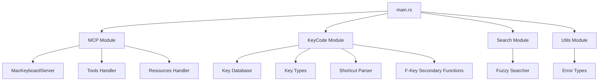
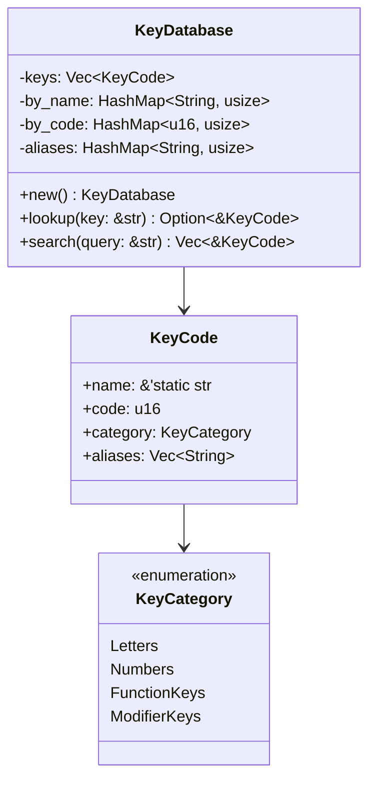
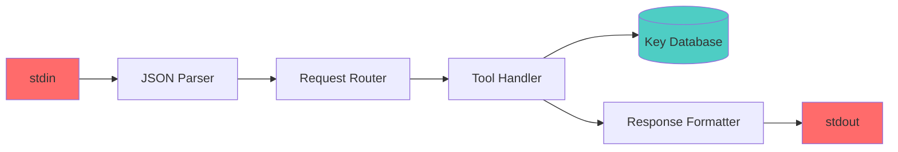

# Server Architecture

This document explores the **static structure** and **design patterns** of our Mac Keyboard MCP server. We'll examine how the codebase is organized and why certain architectural decisions were made.

## High-Level Architecture



### Node Glossary
| Node | Description |
|------|-------------|
| **main.rs** | Entry point and JSON-RPC handler |
| **MCP Module** | Protocol implementation |
| **KeyCode Module** | Core key code logic |
| **Database** | Static key code storage |
| **Fuzzy Searcher** | Typo-tolerant search |

## Module Organization

### 1. Main Module (`main.rs`)

The entry point handles:
- **Async runtime setup** with Tokio
- **JSON-RPC message parsing**
- **Request routing** to appropriate handlers
- **stdio communication** management

Key responsibilities:
```rust
// Message loop
for line in reader.lines() {
    // Parse JSON-RPC
    // Route to handler
    // Send response
}
```

### 2. KeyCode Module (`src/keycode/`)

The heart of the server, organized into submodules:

```
keycode/
├── mod.rs                 # Module exports
├── database.rs           # Key storage and lookup
├── types.rs             # Core data structures
├── parser.rs            # Shortcut parsing
└── secondary_functions.rs # F-key media functions
```

#### Design Pattern: Static Data Repository



### Node Glossary
| Node | Description |
|------|-------------|
| **KeyDatabase** | Singleton storage for all key codes |
| **KeyCode** | Individual key representation |
| **KeyCategory** | Type classification for keys |
| **HashMap** | Fast O(1) lookup structures |

### 3. MCP Module (`src/mcp/`)

Implements the Model Context Protocol:

```
mcp/
├── mod.rs        # Module exports
├── server.rs     # MacKeyboardServer struct
├── tools.rs      # Tool definitions and handlers
└── resources.rs  # Resource definitions
```

#### Design Pattern: Command Pattern

Each tool is a command with:
- **Definition** (name, description, schema)
- **Handler** (execution logic)
- **Response formatting**

```rust
pub async fn handle_lookup(args: Value) -> Result<Value> {
    // 1. Parse arguments
    // 2. Execute lookup
    // 3. Format response
}
```

### 4. Search Module (`src/search/`)

Implements fuzzy string matching for typo tolerance:

```rust
pub struct FuzzySearcher {
    matcher: SkimMatcherV2,
}
```

Uses the **Strategy Pattern** where different search algorithms could be swapped.

### 5. Utils Module (`src/utils/`)

Cross-cutting concerns:
- **Error types** using `thiserror`
- **Common utilities**
- **Type aliases**

## Key Design Patterns

### 1. Singleton Pattern (Key Database)

```rust
pub static KEY_DATABASE: Lazy<KeyDatabase> = Lazy::new(|| {
    let mut db = KeyDatabase::new();
    db.load_keys();
    db
});
```

Benefits:
- Single source of truth
- Lazy initialization
- Thread-safe access

### 2. Builder Pattern (KeyCode Construction)

```rust
KeyCode::new("Space", 49, KeyCategory::SpecialKeys)
    .with_aliases(vec!["Spacebar".to_string()])
```

Benefits:
- Fluent API
- Optional configuration
- Immutable construction

### 3. Repository Pattern (Data Access)

The `KeyDatabase` acts as a repository:
- Encapsulates data storage
- Provides query methods
- Hides implementation details

### 4. Facade Pattern (MacKeyboardServer)

The server provides a simplified interface:
```rust
impl MacKeyboardServer {
    pub fn list_tools(&self) -> Vec<Value>
    pub async fn call_tool(&self, name: &str, args: Value) -> Result<Value>
    pub fn list_resources(&self) -> Vec<Value>
}
```

## Data Flow Architecture



### Node Glossary
| Node | Description |
|------|-------------|
| **stdin** | Raw JSON-RPC input stream |
| **Parser** | Serde deserialization |
| **Router** | Method-based dispatch |
| **Database** | Static key code store |
| **Formatter** | JSON response creation |

## Performance Considerations

1. **O(1) Lookups**: HashMaps for instant key retrieval
2. **Zero-Copy Strings**: `&'static str` for key names
3. **Lazy Initialization**: Database loaded once on first use
4. **Async I/O**: Non-blocking message handling

## Extensibility Points

The architecture supports easy extension:

1. **New Tools**: Add to `tools.rs` with handler function
2. **New Key Codes**: Add to `database.rs` initialization
3. **New Categories**: Extend `KeyCategory` enum
4. **New Search Algorithms**: Implement in search module

## Security Considerations

- **Input Validation**: All inputs deserialize through Serde
- **Memory Safety**: Rust's ownership prevents vulnerabilities
- **No File System Access**: Server is sandboxed to stdio
- **Type Safety**: Strong typing prevents injection attacks

## Related Documentation

- Review [Rust Foundations](./rust-foundations.md) for language concepts
- See [Request Flow](./request-flow.md) for dynamic behavior
- Learn implementation in [Implementation Guide](./implementation-guide.md)

## Next Steps

Now that you understand the static architecture, let's trace how requests flow through the system in [Request Flow](./request-flow.md).